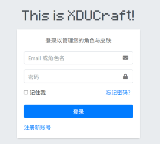
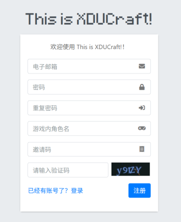

XDUCraft 的大部分服务器（如原版服、大厅服、SMP生电服等）采用自建皮肤站 (www.xducraft.cn) 外置登录。这种方式无需玩家购买 Minecraft 正版账号，只需注册账号并在第三方启动器内做出一点配置即可。对于部分明确了正版登录的服务器（如部分模组服），则不需要进行皮肤站认证。

1. 于浏览器中打开 www.xducraft.cn 后，点击“登录”，如图 1 所示。

2. 在登录页面，点击左下角的“注册新账号”，如图 2 所示。 

3. 按提示填写**有效邮箱**、游戏角色名等信息。游戏角色名即为你在游戏ID。 
> 📢 我们承诺不会发送垃圾邮件，也不会据此收集您的个人信息。 
> 为确保皮肤站账号的正常运行，建议您使用常用邮箱，而**非10分钟邮箱等临时邮箱**，这样可以避免无法收到验证邮件，皮肤站无法登录等不便。

4. 邀请码需联系QQ群内**管理员**（可在群内直接 @ 或私聊）获取，**该项必填**。
5. 填写完毕后，点击“**注册**”。 