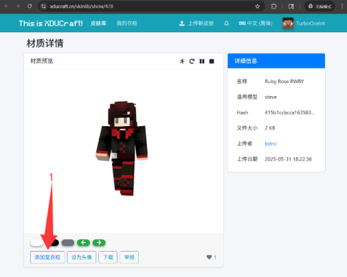
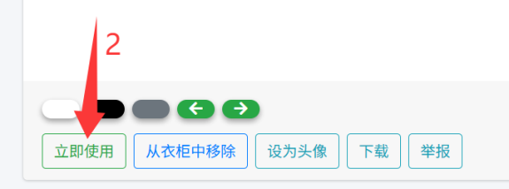
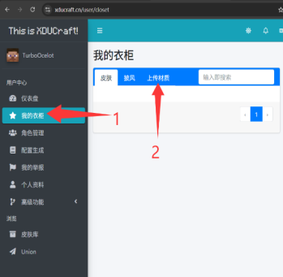
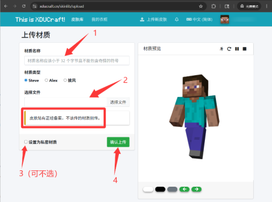

玩家的默认皮肤是 Steve，对于进入游戏来说已经足够，但是你可能还希望有更有个性化的选择，因此我们准备了自定义皮肤功能。
玩家可以自行上传已有的皮肤并设置为公开（其他人也可浏览与使用）或私密（仅自己可使用）；
或者进入 XDUCraft 皮肤库，挑选其他玩家公开的皮肤并使用。
此外，皮肤站还支持披风 （Cape），其上传流程与皮肤类似。

# 使用皮肤库已有的公开皮肤
登录皮肤站，在侧边栏点击“皮肤库”，浏览并挑选一个合适的皮肤。添加到衣柜后，点击立即使用即可完成操作，具体流程见下图。

# 上传自有皮肤
用户也可以上传自己已有的皮肤进行使用，具体流程见图下图。

