> 考虑到有部分新手玩家出于对某特定整合包的兴趣或者经由亲友的推荐选择游玩MC整合包，但又出于找不到教程等一系列原因不知道从何下手，故写此教程以便于新人快速入门。如有未能写明之处，也可看其他群文件里的新人教程或者直接群内发问。  
> ps.实际上是小编教同学尝试新手的第一个整合包被各种问题折磨的头都大了，实在难受，故出此计 QWQ  

# 🗒️  一点备注
1. 注意！本篇指南**并非**意在教会读者如何游玩整合包，而是旨在解决读者正式进入游戏游玩前的大部分普遍存在的疑惑，具体一个整合包的游玩教程可以自行上网搜索，重要的事情（应该是很重要吧）说三遍！三遍！三遍！
2. 本篇指南全程基于 PCL2 环境，如果你使用的是 HMCL 或者其他的 MC 启动器，大致的流程理应不会有太大差别，如果有细节上的不同，请原谅小编无法面面俱到，可以在群内询问或者自行上网搜索教程。
3. 本篇指南全程基于 Win11 环境，故可能出现部分小 Tips 与读者的实际情况有所出入，如有出入，解决方案同2。（ps.你知道的， Win10 与 Win11 还是有亿点啸差距）
4. 本片指南将全程以整合包“Better MC”和“落幕曲”举例（ps.绝对不是因为小编喜欢玩落幕曲的原因< (￣︶￣)>） ，其他的整合包游玩流程基本上不会有太大的出入，如果遇见了特殊问题，解决方案同2。

# ✈️  让我们开始吧｡:.ﾟヽ (*´∀`)ﾉﾟ.:｡  
1. 打开 PCL2， 在主界面上边栏点击“下载”，随后在次级界面点击左侧的“整合包”选项。
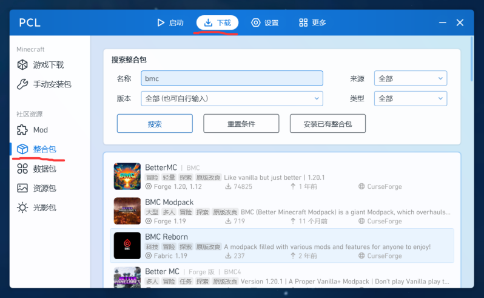
2. 接下来，让我们分成两种情况
    1. 通过PCL2启动器下载
        1. 针对像 Better MC 这种比较经典的“老牌”整合包，可以直接通过 PCL2 内置的搜索功能直接搜索得到，如图
        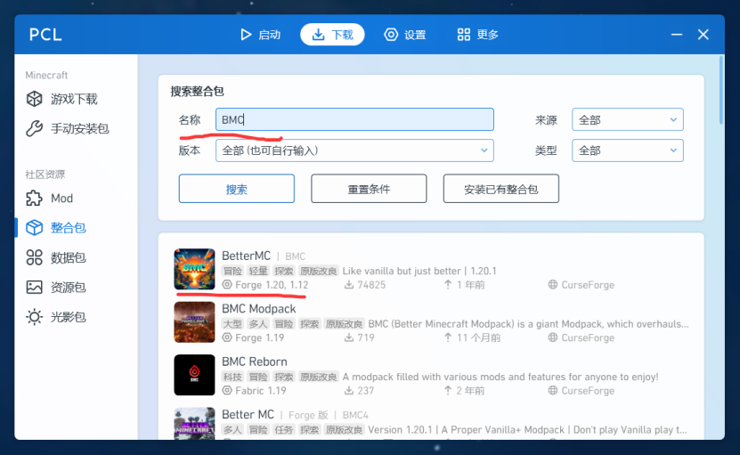
        2. 如果你想游玩的整合包也可以在 PCL2 中直接搜索找到，那么恭喜你，你将会省去一大部分的麻烦，只需要点击一下，进入选择界面
        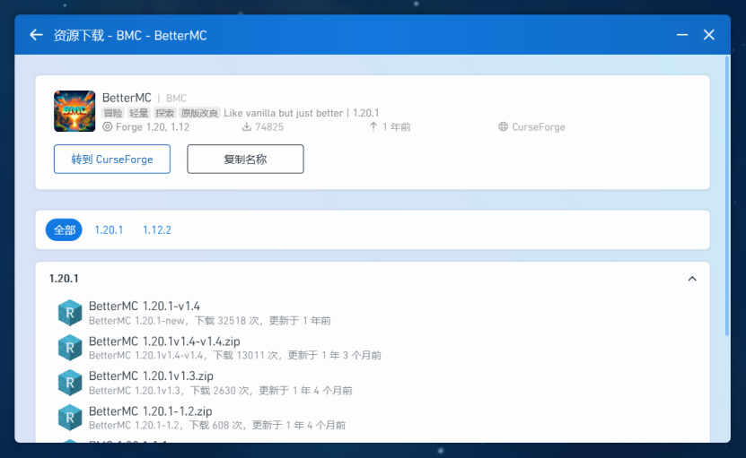
        3. 然后选择你想游玩的 游戏/整合包版本，点击一下，会弹出来一个窗口，在这个窗口，你可以更改“版本名”， 实际上就是你给这个整合包的备注，因而小编个人建议是`整合包名-游戏版本名-整合包版本名`，如图
        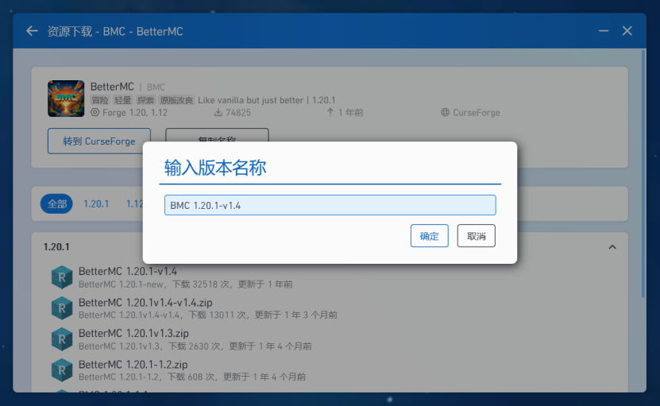
        4. 随后点击确定，右下角就会弹出下载图标
        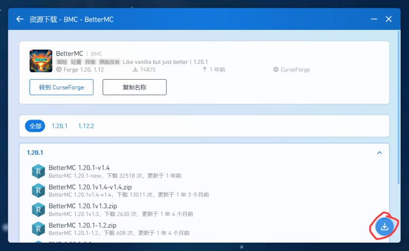
        5. 点击下载图标会看到整合包的具体下载进度，与此同时，像 Better MC 这样的整合包会有一些可选的模组来实现部分功能， PCL2 在下载时会自动弹出窗口询问你是否下载，如果你想更完整的体验可以选择下载，当然，不下载不会影响整合包的完整度，所以实际的选择权在你。
        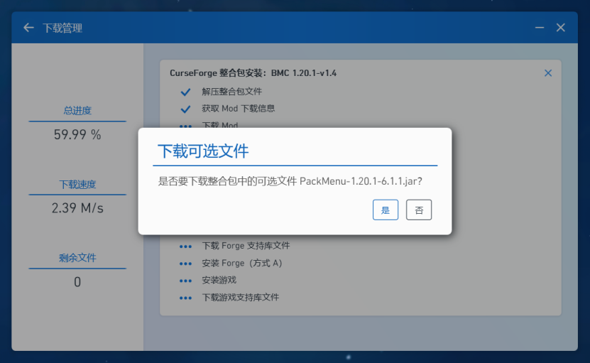
        6. 下载完成之后，回到主界面，点击版本选择，找到你新提的整合包，点击一下就可以开始游玩了ξ( ✿＞ ◡❛)

    2. 通过互联网搜索
        1. 如果你想玩的整合包是像“落幕曲”这样较为“新”，或者出于其他原因无法在 PCL2 或者你选择的 MC 启动器中搜索到的，我们就需要另辟蹊径了，也许你已经注意到了，在 PCL2 的整合包搜索界面，右上角有一个来源的可选项，点开它，你会看到两个名字， CurseForge，以及 Modrinth
        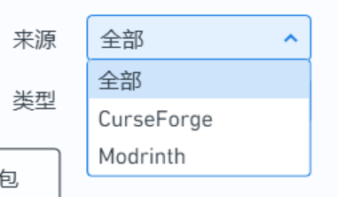
        2. 这两个都是相当成熟的玩家社区，其主要功能就是给玩家提供各种资源，其中， [CurseForge](https://www.curseforge.com/)提供了多种游戏的资源， MC 只是其中一个
        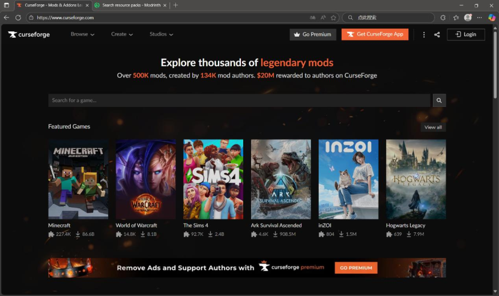
        与之相对的，[Modrinth](https://modrinth.com/modpacks)则是一个专供 MC 资源的社区
        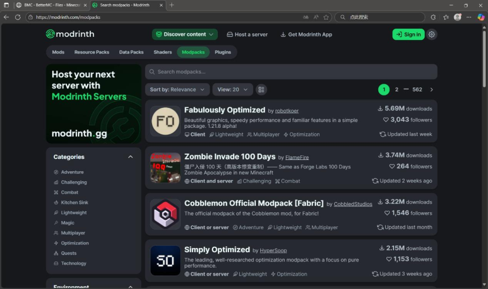
        你可以在这两个网站中搜寻你想游玩的整合包，然后将它们下载下来，值得一提是，如果你选择 CurseForge，则可以在 Files 选项处选择版本
        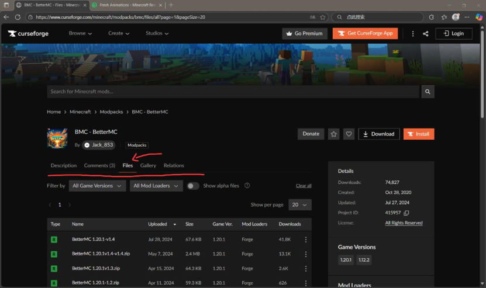
        而若是 Modrinth，则可以在 Versions 选项处选择版本
        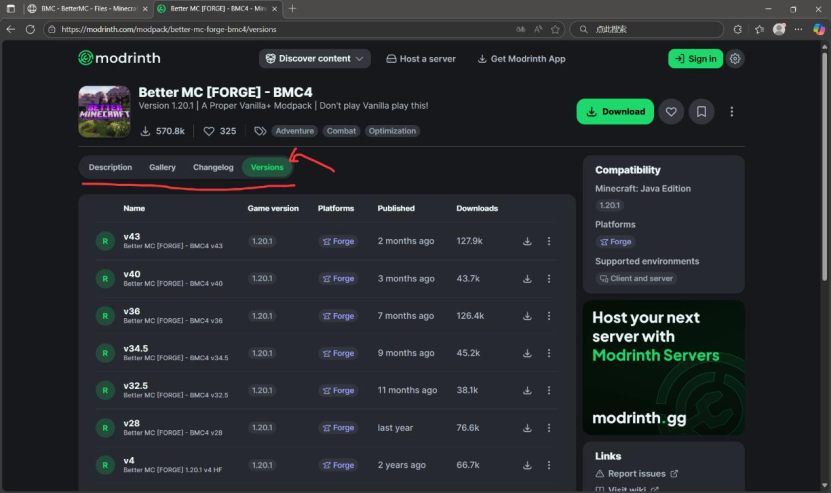
        3. 这时候你可能（ps.实际上是绝对吧ρ(・ ω・ 、 )）发现，“**欸，怎么是个压缩包？**”，不要慌张，在文件夹中找到这个压缩包，直接像你平时移动文件的方式一样，把这个下载好的压缩包文件“拖”到 PCL2 当中，你就会惊喜的发现， PCL2 就开始下载你心仪的整合包了（ps.跟我一起说“赞美PCL2！”）
        4. 你还可能发现， “**主包主包，你不是从开头就在唠叨‘落幕曲’吗，怎么没看见呀**”，小编的回应只能是，“不急，我有一计”，实际上，除了上述的两个成熟的玩家社区之外，（由于近期国产整合包的发展呈现出一片勃勃生机，万物竞发的状态），整合包的实际来源相当广泛，有相当一部分整合包作者，选择直接在 Bilibili 平台上发布了自己创作的整合包的宣传视频，而整合包压缩文件的下载链接就放在了对应视频的简介或者评论区置顶，比如小编最喜欢的落幕曲
        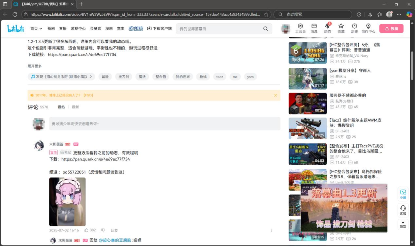
        5. 如果你还是找不到（ps.不能吧，我都这么努力了你怎么还没找到 இдஇ）也可以尝试从其他的渠道寻找，比如 [XyeBBS](https://resource.yxsjmc.cn/)等等，小编在这里就不唠叨了
        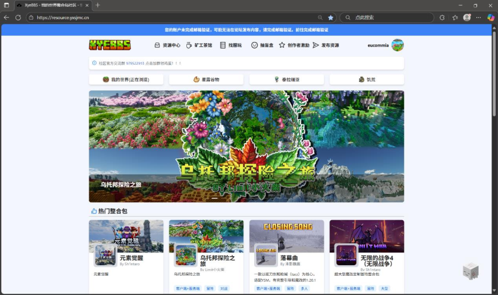

# ⭐️  一点推荐以及 Tips
1. 如果你是一名 MC 新手，应该会经常遇见`shift`键卡输入法的情况，那么你可以选择打开设置里的语言选项，添加英语
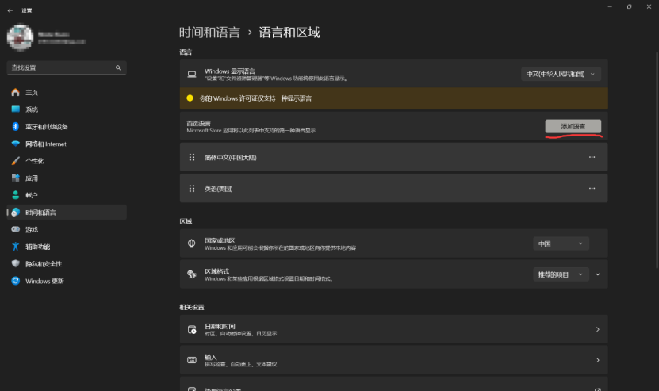
然后在进入游戏之前，将键盘语言（右下角）改成英文即可完全避免此类情况
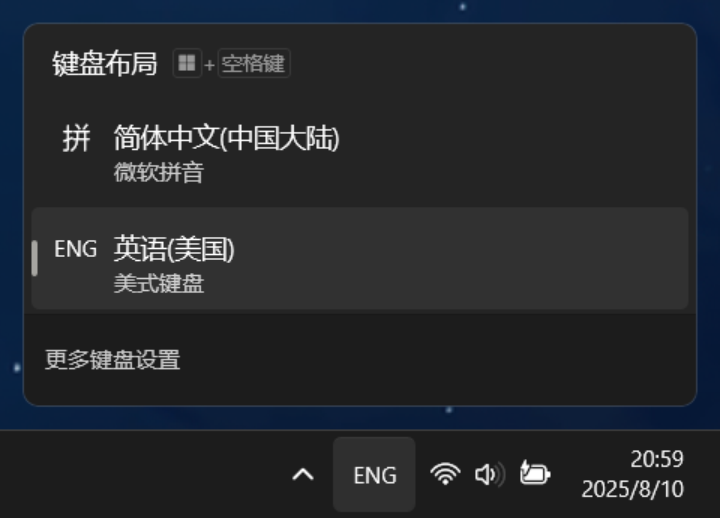
2. 如果你是已经玩了一段时间整合包的老手，结果发现整合包更新了，想把自己旧版本整合包的存档直接转移到新版本去的话
    （ps.接下来以整合包“龙之冒险：新征程”为例，整合包版本为 v2.2 --> v2.3，） 
    （ps.的 ps.不要问为什么是落幕曲，问就是小编一心一意，最爱玩的就是最新版） ， 可以在对应的游戏文件夹中（以小编自己为例子，文件目录就是`D:\PCL2\Release 2.8.6\.minecraft\versions`，实际情况因人而异）
    找到文件夹`saves`，`XaeroWaypoints`，`config`，这三个分别代表了旧版本下**所有的**存档，存档里的路径点（ps.如果你选择的整合包没有 Xaero 小地图模组就没有这个文件夹），存档设置（ps.主要影响键位一类的，也是最有可能出问题的地方）
    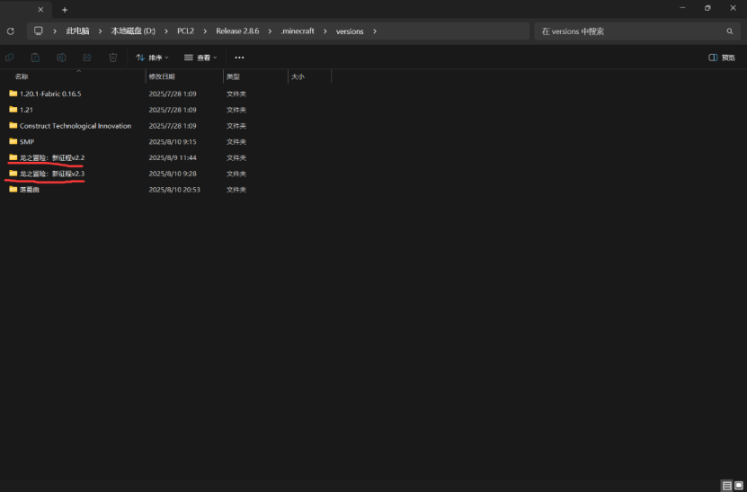
    选中他们，复制，然后直接粘贴到新版本的文件夹当中，如果询问你“同名文件如何处理”，只需要选择“替换”或者是“覆盖”即可
    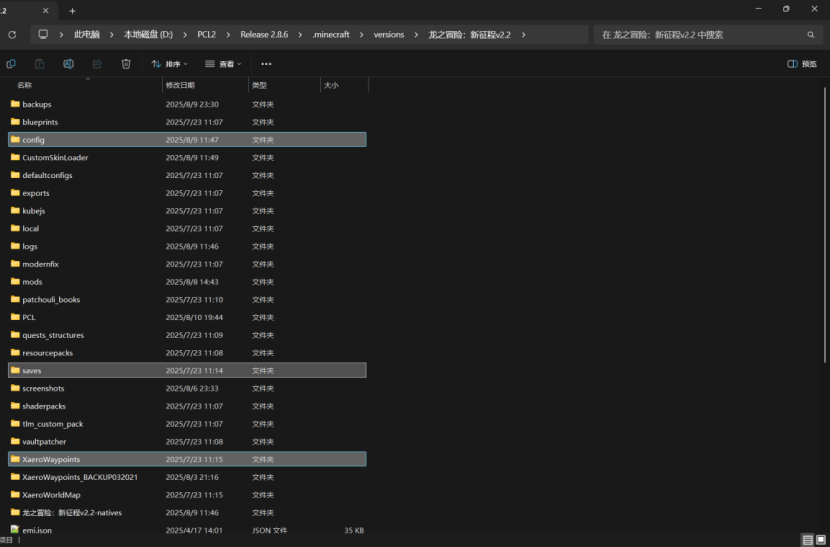
3. 有的整合包（ps.比如“落幕曲”），存在允许玩家自行添加可选 DLC 模组的情况（ps.并非如上文“Better MC”那样的辅助性模组，而是会影响到整合包游玩内容的模组）， 可能存在整合包版本更新后， DLC 模组也采用了较新的版本，因此**切记不要**直接采用旧版整合包的 DLC 模组，最为稳妥的做法是下载整合包作者提供的最新版 DLC 模组，否则的话可能会导致游戏内贴图丢失等一系列不良影响
4. 一般而言，整合包都是可以**免费**游玩所有内容的， 而且按照 MC 的创作公司，即 Mojang 的条例（[EULA | Minecraft](https://www.minecraft.net/zh-hans/eula)），整合包就应当是免费的， 所以如果你在交易平台看见了收费的 MC 整合包，不要因为“方便”，“偷懒“（ps.实际上一点也不方便，偷懒）而**花钱购买**这些整合包
5. 值得一提：当你下载某些整合包资源时，资源的提供方可能向你提供了一些更便携的“游玩”方式，我们通常将此类资源称之为“懒人包”。这里以某宝可梦整合包为例。
    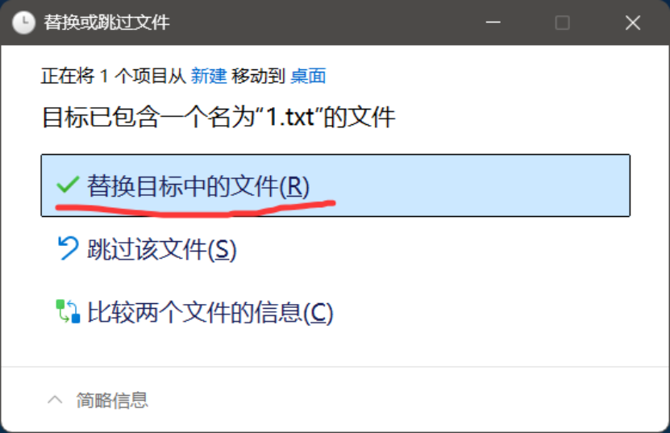
    这类资源往往会配有一个以 `xxx 启动器.exe` 为名的文件（或者 exe 文件）和一个 `.minecraft` 为名的文件夹。此时你有两种方法游玩。
    1. 直接点击这个 exe 文件（如果这个文件夹是在压缩包内的，请将其解压，如未解压，点击时也会提示你进行解压），随后你将可以正常进行游戏
    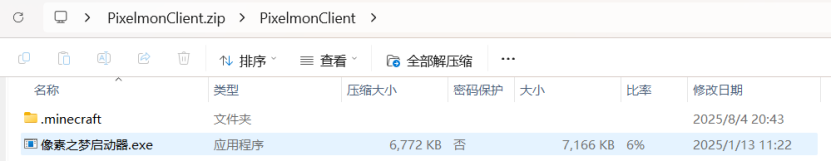
    2. 你也可以将原**压缩包**（注意是压缩包）直接拖入你原有的启动器。此时启动器将提示你选择一个空文件夹。你可以选择任意一个空文件夹以安装游戏文件。此时将在启动器右下角出现一个下载图标（与 2.1.4 配图相同）。解压缩后，会有如图所示的界面。
    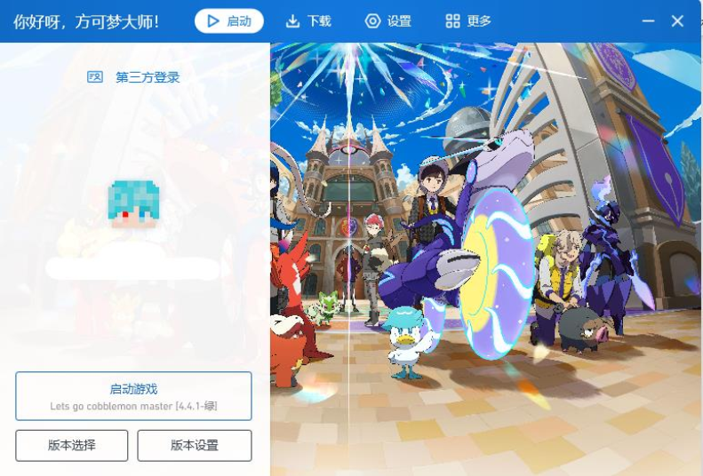
    此时，新建文件夹(2)（名字由你选择的空文件夹决定，小编懒得写名字所以是默认的）所对应的游戏版本即为你选择的整合包。当然，你原有的几个游戏也可在官方启动器文件夹内找到。通过以上任意一种方式，你都可以正常使用懒人包游玩游戏啦！

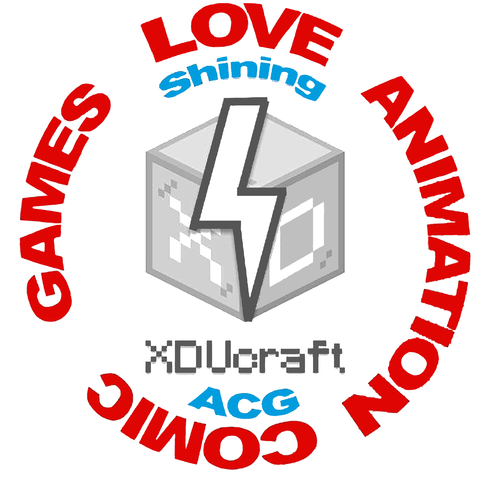